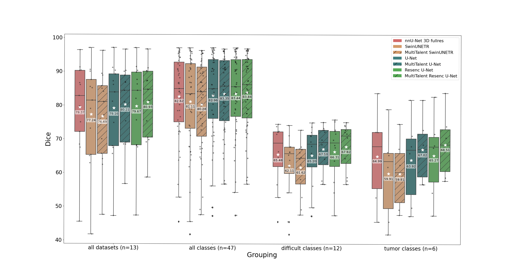

**MultiTalent: A Multi-Dataset Approach to Medical Image Segmentation**

**Requirements**  
This repository is based on  [nnU-Net V1](https://github.com/MIC-DKFZ/nnUNet). 
After cloning this Repository, it is important to follow the original installation instructions to install nnU-Net as an **[integrative framework](https://github.com/MIC-DKFZ/nnUNet/tree/nnunetv1)** and get familiar with it first.     

**Note: We are working on an update to nnU-NetV2.**   
In nnU-Net V1, the project was still very experimental. In V2 we will make the project more user-friendly. 

You can download a trained Multitalent (U-Net and Residual U-Net) model here using the following command:  
`nnUNet_download_pretrained_model Task100_MultiTalent`

After that, you could run the following script for inference:  
`CUDA_VISIBLE_DEVICES=0 python -m torch.distributed.launch --master_port=1224 --nproc_per_node=1 ./nnunet/inference/predict_MultiTalent.py -i inputpath -o outputpath -m path_to_model_folds`    

 

  

**Training with MultiTalent:**  

**Dataset collection**  
In the following, we will give you an instruction how to get and preprocess our partially labelled dataset collection.
You need to download the raw data individually from each dataset origin: 
Dataset 1-6: [MSD](http://medicaldecathlon.com/) (only CT datasets)  
Dataset 7 & 8: [BTCV](https://www.synapse.org/#!Synapse:syn3193805/wiki/217760)  
Dataset 9: [BTCV2](https://zenodo.org/record/1169361#.YiDLFnXMJFE)  
Dataset 10: [StructSeg](https://structseg2019.grand-challenge.org/)  
Dataset 11:  [SegThor](https://competitions.codalab.org/competitions/21145)  
Dataset 12: [NIH-Pan](https://wiki.cancerimagingarchive.net/display/Public/Pancreas-CT)  
Dataset 13: [KiTS19](https://kits19.grand-challenge.org/)  

After downloading, you have to save the files as expected by nnU-Net in your `nnUNet_raw_data_base` directory and to use the right folder structure ([nnU-Net dataset conversion](https://github.com/MIC-DKFZ/nnUNet/blob/master/documentation/dataset_conversion.md)).   
It is important that you choose the same folder names as we did:  
    _'Task003_Liver'  
    'Task006_Lung'  
    'Task007_Pancreas'  
    'Task008_HepaticVessel'  
    'Task009_Spleen'  
    'Task010_Colon'  
    'Task017_AbdominalOrganSegmentation'  
    'Task046_AbdOrgSegm2'  
    'Task051_StructSeg2019_Task3_Thoracic_OAR'  
    'Task055_SegTHOR'  
    'Task062_NIHPancreas'  
    'Task064_KiTS_labelsFixed'  
    'Task018_PelvicOrganSegmentation'  _  

**Preprocessing for training**
1. First, we need to generate our raw dataset for the multi-class training. Run the following script to copy all the images in the right folder, convert the labelmaps, generate the dataset.jason file and transpose the images if needed.  
`/nnunet/dataset_conversion/Task100_MultiTalent.py` It can take around 3 hours, depending on your system.
If you want to extend or change the base dataset collection, you would need to adapt this file!

2. Now, we can use the nn-UNet preprocessing function with a specialized preprocessor:  
`nnUNet_plan_and_preprocess -t 100 -pl3d ExperimentPlanner3D_v21_MultiTalent -pl2d None -tf 16 --verify_dataset_integrity -overwrite_plans_identifier multitalent_bs4` Again, this takes some time.  
This also generates a training plan file that we need for the following network training. By default, this plan generates a batchsize of 2. It is very easy to change the batchsize (see [extending nnU-Net](https://github.com/MIC-DKFZ/nnUNet/blob/master/documentation/extending_nnunet.md)), but you could also use the plans that we provide. 

4. We are almost done, but we need to add the information about the valid labels for each image to the _.pkl_ files:  
`python /nnunet/dataset_conversion/Task100_MultiTalent_addregions.py` This takes only a few seconds.   

**Training of the Multi-Class network**  
First, you should take a look at the nnU-Net V1 distributed training instructions. 
To train a MultiTalent network, run the following command:  
`CUDA_VISIBLE_DEVICES=0,1 python -m torch.distributed.launch --master_port=1234 --nproc_per_node=2 ./nnunet/run/run_training_DDP.py 3d_fullres MultiTalent_trainer_ddp 100  0 -p MultiTalent_bs4 --dbs`

